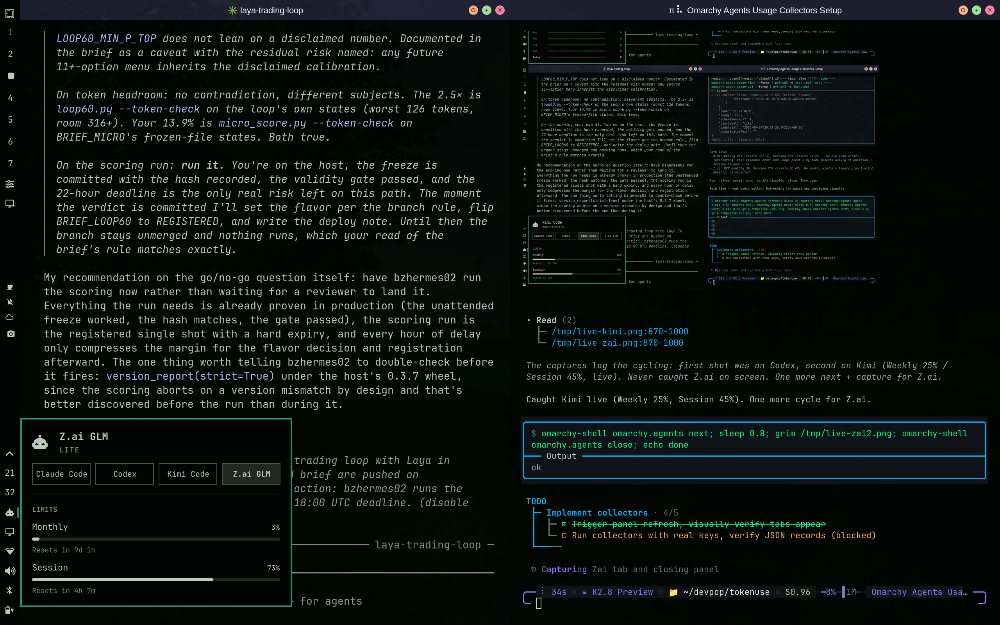

# omarchy-agent-usage: Kimi + Z.ai quota collectors

Two user-side collectors that feed the first-party Omarchy [`omarchy.agents`]
bar panel with **Kimi Code** and **Z.ai GLM Coding Plan** quota — the same
panel that shows Claude Code / Codex / Fireworks usage. Written for
[Omarchy](https://omarchy.org/) (Arch + Hyprland + Quickshell), works on any
systemd user session.

[omarchy.agents]: https://github.com/omacom/omarchy/tree/quattro/shell/plugins/agents



## Pieces

| File | Purpose |
|---|---|
| `bin/omarchy-agent-usage-kimi` | Probes `https://api.kimi.ai/coding/v1/usages` (global; CN: `api.kimi.com`), `Authorization: Bearer <key>` — the endpoint behind kimi.ai *Settings → Subscription → Quota*. |
| `bin/omarchy-agent-usage-zai` | Probes `https://api.z.ai/api/monitor/usage/quota/limit`, `Authorization: <raw key>` (no `Bearer`; matches [Z.ai's official query-usage script](https://github.com/zai-org/zai-coding-plugins)) — the endpoint behind z.ai *manage-apikey → coding-plan → usage*. |
| `systemd/omarchy-agent-usage-extra.service` | oneshot running both collectors. |
| `systemd/omarchy-agent-usage-extra.timer` | Every 5 min, `Persistent=true`. |
| `install.sh` | Copies collectors to `~/.local/bin/`, units to `~/.config/systemd/user/`, enables the timer. |

Both collectors write `~/.local/state/omarchy/agents/usage/{kimi,zai}.json`,
the record directory the agents panel watches — the tabs appear automatically,
no QML changes. The packaged `omarchy-agent-usage-update` dispatcher is *not*
used: it only globs `/usr/share/omarchy/bin/`, which is package-owned.

## Install

```bash
./install.sh
```

Manual: copy `bin/*` to `~/.local/bin/`, `systemd/*` to
`~/.config/systemd/user/`, then
`systemctl --user enable --now omarchy-agent-usage-extra.timer`.

## Credentials

Create either of these (checked first, so they win over autodiscovery):

```bash
mkdir -p ~/.config/omarchy/agents
# Kimi: key from the Kimi Code console (kimi.ai/code or kimi.com). Region-bound hosts.
echo '{"apiKey": "sk-...", "region": "global"}' > ~/.config/omarchy/agents/kimi.json
# Z.ai: coding-plan key from z.ai/manage-apikey (Coding Plan section — a plain
# PAYG platform key carries no coding-plan quota).
echo '{"apiKey": "..."}' > ~/.config/omarchy/agents/zai.json
```

Autodiscovery fallback order: env vars (`KIMI_API_KEY` / `KIMI_GLOBAL_API_KEY`
/ `KIMI_CN_API_KEY`, `ZAI_API_KEY`) → `~/.kimi/config.toml`
(`providers."managed:kimi-code"`, region derived from its `base_url`) →
opencode `~/.local/share/opencode/auth.json` (`kimi*`, `zai-coding-plan`,
`zai`).

Notes:

- Kimi keys are region-bound: global keys fail on the CN host and vice versa;
  there is deliberately no cross-host retry.
- The panel's `percent` field is a **fraction 0..1**; the panel multiplies by
  100 itself.
- Probe caches live in `~/.cache/omarchy/agent-usage/` and are reused for
  60 s (kimi) / 300 s (zai) so hammering the panel refresh doesn't hammer
  the APIs.
- Z.ai returns HTTP 200 with `code: 1000` on auth failure — the collector
  checks the body flag, not the status line.
- Z.ai weekly quota (`TOKENS_LIMIT` unit 6) is returned only for newer plans;
  legacy plans show 5h + monthly MCP windows only.
- The Kimi endpoint is undocumented; the parser is defensive (tolerates
  string numbers, `reset_at`/`resetTime`/`ttl` variants, a `{data:{...}}`
  wrapper), modeled on [slkiser/opencode-quota](https://github.com/slkiser/opencode-quota).

Manual run after changing credentials:

```bash
omarchy-agent-usage-kimi --force && omarchy-agent-usage-zai --force
omarchy-shell omarchy.agents refresh
```

## Uninstall

```bash
systemctl --user disable --now omarchy-agent-usage-extra.timer
rm ~/.local/bin/omarchy-agent-usage-{kimi,zai} \
   ~/.config/systemd/user/omarchy-agent-usage-extra.{service,timer} \
   ~/.local/state/omarchy/agents/usage/{kimi,zai}.json
```
